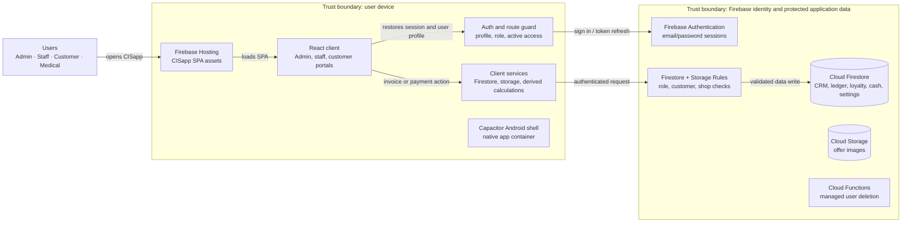

# CISapp runtime architecture

This Archify high-level diagram shows CISapp's core runtime components, one primary path, its external dependencies, and its trust boundaries. Supporting detail is held in cards so the diagram stays readable.

## Primary runtime path — invoice or payment

1. An Admin or Staff user signs in through Firebase Authentication. The React app reads the active `users/{uid}` profile and its role/shop access.
2. The user creates or updates an invoice or payment. The client validates the form and submits the Firestore write.
3. Firestore Rules independently check the identity, active profile, role, customer/shop scope, allowed document fields, and branch envelope before permitting the write.
4. Firestore saves the CRM/ledger record. Staff and customer pages load their permitted data from Firestore.

## Supporting cards

### Client application

| Component | Runtime responsibility |
|---|---|
| React + Vite SPA | Loads separate admin/staff and customer/medical routes. Page modules are lazy-loaded. |
| Auth context and protected routes | Tracks Firebase session, reads the user profile, and limits UI routes by role. This is usability control; Rules remain the security authority. |
| Firestore services | CRUD for customers, invoices, payments, loyalty, collections, cash and settings; performs derived calculations used by analytics and customer views. |
| Customer portal data hook | Loads customer-safe CRM, invoice, payment, partner points, offers, rewards and credit summary records. |
| Capacitor Android shell | Packages the SPA as an Android application. |

### Firebase application services

| Component | Purpose | Security responsibility |
|---|---|---|
| Firebase Hosting | Delivers the built SPA and rewrites application routes to `index.html`. | Public asset delivery only. |
| Firebase Authentication | Provides email/password identity and renewable user tokens. | Establishes the caller identity used by Rules and callable functions. |
| Cloud Firestore | Stores users, customers, invoices, payments, monthly/derived data, loyalty data, settings and cash. | Applies Firestore Rules to every client query and write. |
| Cloud Storage | Stores admin-managed offer images. | Storage Rules control permitted object access. |
| Cloud Functions | Deletes managed users through a callable endpoint. | Validates caller identity and Admin access before using the Admin SDK. |

### Data and authorization boundaries

| Boundary | Data crossing it | Enforcement |
|---|---|---|
| User device → Firebase Authentication | Login credentials, session token refresh | Firebase Authentication and client-side input validation. |
| React client → Firestore | Queries, transactions, document writes and reads | Firestore Rules check active status, Admin/Staff/Customer/Medical role, owned customer, shop/branch scope and document schema. |
| React client → Cloud Storage | Offer image upload/read | Storage Rules. |
| React client → callable Functions | Managed-user deletion requests | Callable Functions validate `request.auth`, role and input before using Admin SDK. |

### Main collections and their use

| Area | Representative collections | Used by |
|---|---|---|
| Identity and access | `users` | Auth context, Rules, Functions |
| CRM and accounting | `customers`, `invoices`, `payments`, `dueCustomers` | Admin/staff billing, payments, collections, customer portal |
| Partner program | `offers`, `rewardItems`, `redemptionRequests`, `loyaltyLedger`, `pcBalances` | Customer offers/rewards and admin review |
| Credit and collection controls | `customerCreditProfiles`, `customerCreditSummaries`, `creditAuditLogs` | Admin credit controls and customer-safe credit view |
| Shop cash | `shopCash`, `cashExpenses`, `shopTransfers`, `cashAdjustments` | Branch cash position and Cash app integration |
| Settings and derived data | `settings`, monthly customer/analytics summaries | Rules-driven configuration, reporting and analytics |

## Runtime notes

- CISapp has client-side calculations and server-side user management. Client calculations improve responsiveness; Firestore Rules protect all direct data access.
- There is no custom REST backend. Cloud Functions are the server-side execution layer for privileged user management.
- Firebase web configuration is public browser configuration. It is not a credential granting access; authentication, Rules and callable-function checks enforce access.
